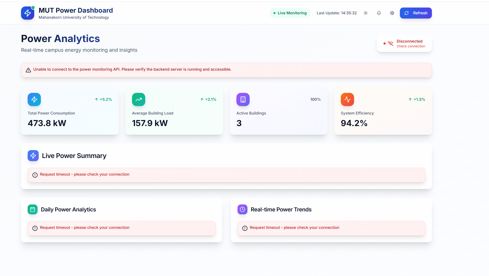

# MUT Power Monitor Dashboard (Frontend)

这是一个使用 **Next.js 15** 和 **React 18** 构建的校园用电监控前端项目，主要展示各建筑的用电概况、日统计以及半小时趋势图表。界面风格现代，支持深色/浅色模式切换，目前所有数据均通过 `lib/api.ts` 里的接口函数获取，可根据需要替换为真实后端地址。



## 功能特色

- **实时概览**：显示各建筑最近的功率数据
- **统计图表**：提供日统计和半小时趋势折线图
- **深浅主题**：集成 `next-themes`，可一键切换
- **响应式设计**：Tailwind CSS 布局，适配手机到桌面端

## 快速开始

### 环境要求
- Node.js 18 及以上
- pnpm、npm 或 yarn 包管理器

### 启动项目
1. 克隆仓库并安装依赖
   ```bash
   git clone <repo-url>
   cd power_monitor_frontend
   npm install        # 或 pnpm install / yarn install
   ```
2. 运行开发服务器
   ```bash
   npm run dev
   ```
3. 打开浏览器访问 [http://localhost:3000](http://localhost:3000)

如需构建生产版本，可执行 `npm run build`，然后使用 `npm start` 启动。

### API 设置
接口基础地址在 [`lib/api.ts`](lib/api.ts) 中通过 `BASE_URL` 常量指定，默认指向 `http://192.168.1.100:8000`。实际部署时请修改为对应的后端地址。

## 项目结构

- `app/`：Next.js 应用入口与布局
- `components/`：页面及通用组件
- `lib/`：API 请求封装与工具函数
- `styles/`：全局样式与 Tailwind 配置

## 许可证

本项目基于 [MIT](LICENSE) 协议发布。
